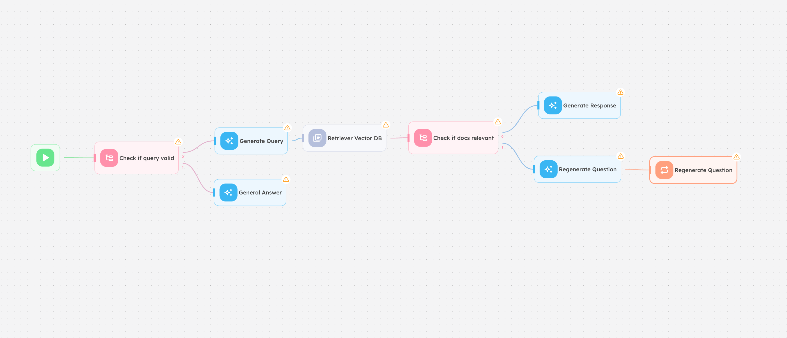

# Agentic RAG

### Creator : [selim@agentron.ai](selim@agentron.ai)


Bu agentflow, **Agentic RAG** (Retrieval-Augmented Generation) olarak bilinen pattern'e bir örnektir. Klasik RAG sistemlerinden farklı olarak, bu akış kendi kendini düzeltebilen, sorgu kalitesini değerlendiren ve gerektiğinde soruyu yeniden üreten akıllı bir döngü içerir.

---


## Overview

Agentic RAG, kullanıcı sorgusunu doğrudan bir vektör veritabanına göndermek yerine önce sorgunun geçerliliğini ve elde edilen belgelerin alaka düzeyini denetleyen bir yapıya sahiptir. Sistem, alınan belgeler yeterince alakalı değilse soruyu otomatik olarak yeniden formüle ederek daha iyi sonuçlar üretmeye çalışır.

---

## Flow Mimarisi

Aşağıdaki diyagram, akışın adım adım nasıl çalıştığını göstermektedir:



### Adımlar

```
Başlangıç
   │
   ▼
┌─────────────────────┐
│  Check if Query     │  ← Gelen sorgu geçerli mi?
│  Valid              │
└────────┬────────────┘
         │
    ┌────┴─────┐
    │          │
    ▼          ▼
Generate    General
Query       Answer
    │
    ▼
Retrieve Vector DB  ← Vektör veritabanından ilgili belgeler çekilir
    │
    ▼
┌─────────────────────┐
│  Check if Docs      │  ← Belgeler soruyla alakalı mı?
│  Relevant           │
└────────┬────────────┘
         │
    ┌────┴──────────┐
    │               │
    ▼               ▼
Generate        Regenerate
Response        Question ──► (Döngü: tekrar Retrieve)
```

### Node Açıklamaları

| Node | Tip | Açıklama |
|------|-----|----------|
| **Check if Query Valid** | Router | Gelen sorgunun anlamlı ve işlenebilir olup olmadığını kontrol eder. Geçersiz sorgular doğrudan genel cevaba yönlendirilir. |
| **Generate Query** | AI | Kullanıcı sorgusunu vektör araması için optimize edilmiş bir arama sorgusuna dönüştürür. |
| **General Answer** | AI | Geçersiz veya kapsam dışı sorgular için genel bir yanıt üretir. |
| **Retrieve Vector DB** | Vector Store | Üretilen sorguya göre vektör veritabanından en alakalı belge parçalarını (chunks) getirir. |
| **Check if Docs Relevant** | Router | Getirilen belgelerin kullanıcı sorusuyla yeterince alakalı olup olmadığını değerlendirir. |
| **Generate Response** | AI | Alakalı belgeler kullanılarak kapsamlı ve doğru bir yanıt üretilir. |
| **Regenerate Question** | AI | Belgeler yetersizse soruyu farklı bir açıdan yeniden formüle ederek döngüyü başlatır. |

---

## Temel Özellikler

- **Sorgu Doğrulama**: Girdi kalitesini ön filtreden geçirerek gereksiz işlemleri önler
- **Dinamik Sorgu Optimizasyonu**: Ham kullanıcı sorgusunu vektör aramasına uygun hale getirir
- **Alaka Denetimi**: Getirilen belgeler yetersizse akış otomatik olarak kendini düzeltir
- **Self-Correction Döngüsü**: Soruyu yeniden formüle ederek daha iyi sonuçlar arar
- **Genel Yanıt Fallback**: Kapsam dışı sorgular için graceful degradation sağlar

---

## Klasik RAG ile Farkı

| Özellik | Klasik RAG | Agentic RAG |
|---------|-----------|-------------|
| Sorgu doğrulama | Yok | Var |
| Belge alaka kontrolü | Yok | Var |
| Self-correction döngüsü | Yok | Var |
| Sorgu optimizasyonu | Manuel | Otomatik |
| Yanıt kalitesi | Sabit | Adaptif |

---

## Kurulum

### Gereksinimler

- [EmploidAI](https://app.emploid.ai) (self-hosted veya cloud)
- Vektör veritabanı (Local, Pinecone, Qdrant, Weaviate vb.)
- LLM API anahtarı (OpenAI, Anthropic vb.)

### Import Adımları

1. EmploidAI a giris yapin.
2. **Agentflows → Ilgili Flow - Import** butonuna tiklayin
3. `Agentic RAG Agent Flow.json` dosyasını import edin
4. Credential'ları yapılandırın:
   - LLM provider API key
   - Vector DB bağlantısı
5. Workflow'u aktif edin

---

## Yapılandırma

### Vektör Veritabanı

`Retrieve Vector DB` node'unda kullanmak istediğiniz vektör veritabanını ve koleksiyon adını ayarlayın.

### LLM Modeli

`Generate Query`, `Generate Response` ve `Regenerate Question` node'larında istediğiniz modeli seçebilirsiniz. Önerilen modeller:
- `gpt-4o` (OpenAI)
- `claude-sonnet-4-6` (Anthropic)

### Alaka Eşiği

`Check if Docs Relevant` node'unda benzerlik skoru eşiğini iş gereksinimlerinize göre ayarlayın.

---

## Kullanım Senaryoları

- **Kurumsal Bilgi Tabanı**: Şirket dokümanlarına akıllı soru-cevap
- **Teknik Dokümantasyon Asistanı**: Kod ve API dokümanları üzerinde RAG
- **Müşteri Destek Otomasyonu**: Ürün bilgi tabanından otomatik yanıt üretimi
- **Araştırma Asistanı**: Akademik veya iç araştırma belgelerini sorgulama

---

## Lisans

MIT License
