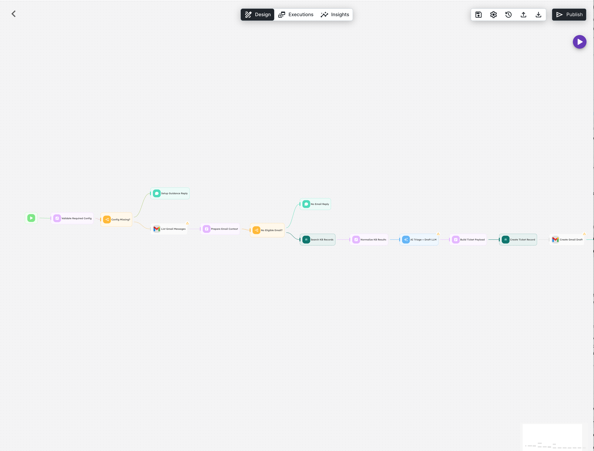

# Support Email Reply Assistant

### Creator : [selim@agentron.ai](selim@agentron.ai)

Bu agentflow, Gmail support inbox icindeki son uygun email'i alip `Collections` tabanli bir knowledge base ile ground ederek customer-facing reply taslagi ureten ve ayni zamanda support ticket log kaydi acan bir akisidir. Akis mail gondermez; yalnizca Gmail draft olusturur.

---

## Overview

Bu template enterprise support ekipleri icin `draft only` reply copilot mantigiyla tasarlanmistir:

- Gmail inbox'tan son uygun support email'i ceker
- Gerekli config eksikse setup guidance reply dondurur
- Email iceriginden KB arama query'si olusturur
- Native `Collections` icindeki support knowledge base'de arama yapar
- Tek bir `LLM` node'u ile hem triage hem grounded reply draft uretir
- Ticket kaydini native `Collections` icine yazar
- Gmail uzerinde reply draft olusturur
- Kullaniciya ticket ID ve draft olusturma bilgisini dondurur

Bu tasarimda otomatik gonderim yoktur. V1 amaci, support ekibine guvenli bir draft ve kayit akisi saglamaktir.

---

## Flow Mimarisi



```text
Start Button
   |
   v
Validate Required Config
   |
   +--> Config missing
   |       |
   |       v
   |   Setup Guidance Reply
   |
   +--> Config OK
           |
           v
      List Gmail Messages
           |
           v
      Prepare Email Context
           |
           +--> No eligible email
           |       |
           |       v
           |   No Email Reply
           |
           +--> Email found
                   |
                   v
              Search KB Records
                   |
                   v
              Normalize KB Results
                   |
                   v
              AI Triage + Draft LLM
                   |
                   v
              Build Ticket Payload
                   |
                   v
              Create Ticket Record
                   |
                   v
              Create Gmail Draft
                   |
                   v
              Success Reply
```

---

## Node Gruplari

| Grup | Node Tipi | Amac |
|------|-----------|------|
| **Support Email Reply Assistant** | Start | Inbox-driven calismayi baslatir ve runtime state'i yukler. |
| **Validate Required Config** | CustomFunction | `supportTicketCollectionId`, `supportKnowledgeCollectionId`, `supportInboxQuery` alanlarini kontrol eder. |
| **Config Missing?** | Condition | Eksik setup varsa guidance branch'ine gecer. |
| **Setup Guidance Reply** | DirectReply | Import sonrasi yapilmasi gereken ayarlari net olarak bildirir. |
| **List Gmail Messages** | Gmail | Gmail inbox'tan secilen query ile son email'i alir. |
| **Prepare Email Context** | CustomFunction | Email'i normalize eder, gonderen bilgilerini cozer ve KB search query'si olusturur. |
| **No Eligible Email?** | Condition | Uygun email yoksa akis no-email reply ile sonlanir. |
| **No Email Reply** | DirectReply | Query'ye uyan email bulunmadigini bildirir. |
| **Search KB Records** | Collections | KB collection icinde ilgili bilgi parcalarini arar. |
| **Normalize KB Results** | CustomFunction | KB arama sonucunu LLM icin kullanilabilir JSON stringe cevirir. |
| **AI Triage + Draft LLM** | LLM | Triage ve grounded reply draft ciktisini birlikte uretir. |
| **Build Ticket Payload** | CustomFunction | `ticketId`, `draftRecipient`, `ticketRecordPayload` ve normalize edilmis state alanlarini olusturur. |
| **Create Ticket Record** | Collections | Ticket log collection icinde yeni kayit acar. |
| **Create Gmail Draft** | Gmail | Customer-facing reply icin draft olusturur. |
| **Success Reply** | DirectReply | Ticket kaydi ve draft olustugunu bildirir. |

---

## Start ve Flow State

Start node `startButton` modunda calisir. Form kullanilmaz; bu template inbox-driven tasarlanmistir.

Start state icinde tanimli key'ler:

- `supportInboxQuery`
  Default: `in:inbox is:unread -in:sent -in:drafts -in:trash`
- `supportTicketCollectionId`
- `supportKnowledgeCollectionId`
- `defaultStatus`
  Default: `draft_ready`
- `defaultAssigneeTeam`
  Default: `support`
- `ticketPrefix`
  Default: `SUP`
- `kbResultLimit`
  Default: `5`
- `ticketId`
- `createdAtIso`
- `sourceMessageId`
- `sourceThreadId`
- `sourceFromEmail`
- `sourceFromName`
- `sourceSubject`
- `sourceBody`
- `kbSearchQuery`
- `kbSearchResultsJson`
- `triageCategory`
- `triagePriority`
- `triageSummary`
- `triageSuggestedTeam`
- `triageNextAction`
- `draftReplySubject`
- `draftReplyBody`
- `draftRecipient`
- `usedKnowledge`
- `needsHumanReview`
- `ticketRecordPayload`
- `hasRequiredConfig`
- `setupGuidance`
- `hasEligibleEmail`

### State Akisi

1. `Validate Required Config` node'u `hasRequiredConfig` ve `setupGuidance` alanlarini doldurur.
2. `Prepare Email Context` node'u source email alanlarini ve `kbSearchQuery` degerini uretir.
3. `Normalize KB Results` node'u `kbSearchResultsJson` state'ini doldurur.
4. `AI Triage + Draft LLM` node'u triage ve draft alanlarini state'e yazar.
5. `Build Ticket Payload` node'u ticket kaydi ve draft metadata'sini finalize eder.

---

## Gmail Intake Davranisi

`List Gmail Messages` node'u:

- `gmailType = messages`
- `messageAction = listMessages`
- `messageQuery = {{ $flow.state.supportInboxQuery }}`
- `messageMaxResults = 1`

Sonrasinda `Prepare Email Context` node'u:

- Ilk email'i secer
- `sourceFromEmail`, `sourceFromName`, `sourceSubject`, `sourceBody` alanlarini doldurur
- `kbSearchQuery` olusturur
- Email bulunmazsa `hasEligibleEmail = false` yapar

### Onemli Teknik Not

Bu repodaki mevcut agentflow Gmail `listMessages` implementasyonu normalize edilmis email detaylarini dondurur, ancak `messageId` ve `threadId` alanlarini expose etmez. Bu nedenle:

- `sourceMessageId`
- `sourceThreadId`
- `gmailMessageId`
- `gmailThreadId`

alanlari v1'de bos string olarak tutulur. Template yapisi bu alanlari korur; Gmail node'u ileride ID bilgisi dondurmeye baslarsa flow kolayca genisletilebilir.

---

## Collections KB Grounding

Bu template knowledge grounding icin yalnizca native `Collections` kullanir.

### Knowledge Collection

`supportKnowledgeCollectionId` ile hedeflenen KB collection minimum su field'lari icermelidir:

- `title`
- `content`

Opsiyonel field'lar:

- `category`
- `tags`

`Search KB Records` node'u:

- `mode = searchRecords`
- `collectionId = {{ $flow.state.supportKnowledgeCollectionId }}`
- `query = {{ $flow.state.kbSearchQuery }}`
- `limit = {{ $flow.state.kbResultLimit }}`

Arama sonucu `Normalize KB Results` node'u ile `kbSearchResultsJson` state'ine yazilir.

---

## AI Output Davranisi

Tek bir `LLM` node'u iki isi birlikte yapar:

1. Triage
2. Grounded reply draft generation

### Structured Output Fields

- `category`
  Enum: `bug`, `billing`, `access`, `feature_request`, `general_question`, `account`, `integration`, `other`
- `priority`
  Enum: `low`, `normal`, `high`, `critical`
- `summary`
- `suggestedTeam`
  Enum: `support`, `product`, `engineering`, `billing`, `ops`
- `nextAction`
- `replySubject`
- `replyBody`
- `usedKnowledge`
  `stringArray`
- `needsHumanReview`
  `boolean`

### Prompt Kurallari

- Reply email'in diliyle ayni dilde yazilir
- Bilgi uydurma yok
- Factual claim'ler yalnizca KB sonucuna dayandirilir
- KB yetersizse kontrollu bilgi toplama draft'i yazilir
- Customer-facing draft uretir ama gonderim yapmaz
- Kurumsal, kisa ve profesyonel ton kullanir

---

## Ticket Record Creation

`Build Ticket Payload` node'u su alanlari finalize eder:

- `ticketId`
  Format: `<ticketPrefix>-<YYYYMMDD>-<short id>`
- `createdAtIso`
- `draftRecipient`
- `ticketRecordPayload`

### Ticket Collection Minimum Schema

`supportTicketCollectionId` ile hedeflenen ticket collection minimum su field'lari icermelidir:

- `ticketId`
- `createdAt`
- `status`
- `gmailMessageId`
- `gmailThreadId`
- `fromEmail`
- `fromName`
- `subject`
- `messageBody`
- `category`
- `priority`
- `summary`
- `assignedTeam`
- `nextAction`
- `draftReplySubject`
- `draftReplyBody`
- `usedKnowledge`
- `needsHumanReview`

### Payload Icerigi

Collections kaydina yazilan minimum veri:

- `ticketId`
- `createdAt`
- `status`
- `gmailMessageId`
- `gmailThreadId`
- `fromEmail`
- `fromName`
- `subject`
- `messageBody`
- `category`
- `priority`
- `summary`
- `assignedTeam`
- `nextAction`
- `draftReplySubject`
- `draftReplyBody`
- `usedKnowledge`
- `needsHumanReview`

---

## Gmail Draft Davranisi

Template auto-send yapmaz. Sadece draft olusturur.

`Create Gmail Draft` node'u:

- `gmailType = drafts`
- `draftAction = createDraft`
- `draftTo = {{ $flow.state.draftRecipient }}`
- `draftSubject = {{ $flow.state.draftReplySubject }}`
- `draftBody = {{ $flow.state.draftReplyBody }}`

Bu tasarim enterprise ekipler icin daha guvenlidir; insan gozden gecirmesi icin yer birakir.

---

## User-Facing Replies

### Setup Guidance Reply

Eksik config durumunda su alanlari ozellikle bildirir:

- `supportTicketCollectionId`
- `supportKnowledgeCollectionId`
- `supportInboxQuery`
- Gmail credential setup
- LLM model secimi

### No Email Reply

Query'ye uyan email bulunmazsa akis durur ve sadece bilgi reply'i dondurur.

### Success Reply

Basarili durumda:

- `ticketId`
- `category`
- `priority`
- `assigned team`
- draft olusturuldu bilgisi

kullaniciya dondurulur.

---

## Kurulum

### Gereksinimler

- [EmploidAI](https://app.emploid.ai)
- En az bir LLM provider baglantisi
- Native Collections erisimi
- Gmail OAuth credential

### Import Adimlari

1. EmploidAI'a giris yapin.
2. **Agentflows** ekranina gidin.
3. Import islemini baslatin.
4. `Support Email Reply Assistant Agent Flow.json` dosyasini import edin.
5. `AI Triage + Draft LLM` node'unda model secin.
6. Iki `Collections` node'u icin gerekli collection ID'lerin `startState` icinde dogru oldugunu kontrol edin.
7. Iki `Gmail` node'una `gmailOAuth2` credential baglayin.
8. `supportInboxQuery` alanini kendi support inbox mantiginiza gore duzenleyin.
9. Flow'u calistirip tek email senaryosunda test edin.

---

## Collections Pre-setup

Bu template iki ayri collection bekler:

1. Knowledge collection
2. Ticket log collection

### Onerilen Knowledge Collection

Collection adi ornek:

- `supportKnowledgeBase`

Minimum field'lar:

- `title`
- `content`

Opsiyonel field'lar:

- `category`
- `tags`

### Onerilen Ticket Log Collection

Collection adi ornek:

- `supportEmailTickets`

Minimum field'lar:

- `ticketId`
- `createdAt`
- `status`
- `gmailMessageId`
- `gmailThreadId`
- `fromEmail`
- `fromName`
- `subject`
- `messageBody`
- `category`
- `priority`
- `summary`
- `assignedTeam`
- `nextAction`
- `draftReplySubject`
- `draftReplyBody`
- `usedKnowledge`
- `needsHumanReview`

### Field Tipi Onerileri

- Metin alanlari icin string/text
- `messageBody`, `summary`, `draftReplyBody` icin long text
- `createdAt` icin datetime
- `usedKnowledge` icin JSON veya text array destekleyen field
- `needsHumanReview` icin boolean

---

## Kullanim Notlari

- Bu template tek run'da tek email isler.
- Batch processing v1 disindadir.
- Mail gondermez, sadece draft olusturur.
- Knowledge source yalnizca `Collections` tabanlidir.
- KB yetersizse model kontrollu bilgi toplama draft'i yazar.
- `needsHumanReview` alaninin default enterprise mantigi geregi kritik olaylarda `true` donmesi normal kabul edilmelidir.
- `sourceMessageId` ve `sourceThreadId` alanlari agentflow Gmail node siniri nedeniyle v1'de bos kalabilir.

---

## Onerilen Modeller

- `gpt-4o`
- `claude-sonnet-4-6`

Bu template hem classification hem grounded reply urettigi icin orta-ust kalite bir model tercih edilmesi daha sagliklidir.

---

## Test Senaryolari

### JSON / wiring

- JSON parse edilmeli
- Tum node ve edge referanslari gecerli olmali
- CustomFunction node'larinin JavaScript'i compile edilmeli
- State variable referanslari hatasiz olmali

### Functional scenarios

1. `supportTicketCollectionId` bos
   Setup guidance branch'i calismali
2. `supportKnowledgeCollectionId` bos
   Setup guidance branch'i calismali
3. `supportInboxQuery` bos
   Setup guidance branch'i calismali
4. Query'ye uyan email yok
   No-email branch'i calismali
5. Email bulundu
   KB aramasi yapilmali
6. LLM structured output
   `category`, `priority`, `summary`, `suggestedTeam`, `nextAction`, `replySubject`, `replyBody`, `usedKnowledge`, `needsHumanReview` donmeli
7. Ticket record creation
   Collections icinde yeni ticket kaydi olusmali
8. Draft creation
   Gmail draft olusmali, send olmamali
9. Success reply
   Ticket ID ve draft recipient bilgisi dondurmali

---

## Lisans

MIT License
